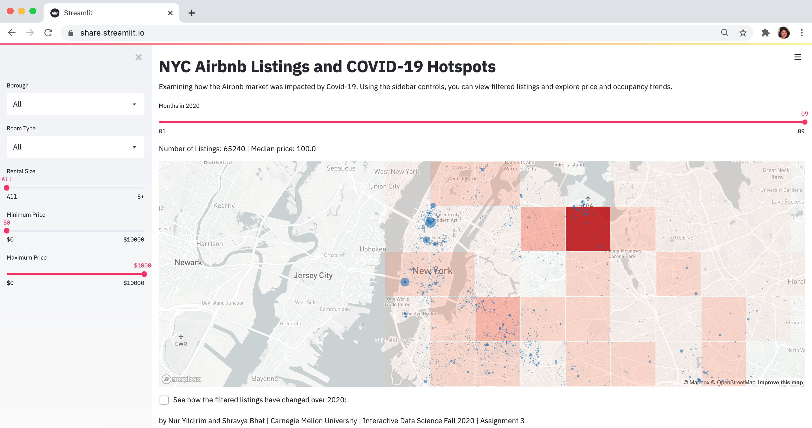

# NYC Airbnb Listings and COVID-19 Hotspots

Covid-19 has impacted the hospitality industry significantly. Airbnb is one of the most affected businesses with the travel restrictions across countries and regions. With this project, we aimed to create a tool that allows users to explore the impact of Covid-19 on the Airbnb market in New York City, which was a major hotspot for coronavirus in the US. Using this interactive tool, users can inspect the current Airbnb listings and monitor the density of Covid-19 cases in corresponding neighborhoods.

Our tool benefits two user groups. First, it enables hosts to monitor the changes in their listing’s neighborhood with regard to Covid-19, such as the supply, demand, prices, and covid cases. This can support hosts in making informed decisions on whether to list or not. Second, our tool allows users to make better judgments on assessing the risks of staying at an Airbnb listing in particular boroughs and neighborhoods.

## Project Goals

TODO: **A clear description of the goals of your project.** Describe the question that you are enabling a user to answer. The question should be compelling and the solution should be focused on helping users achieve their goals.

Our primary goal was to **enable users to monitor the current situation in NYC in terms of Airbnb listing locations and the corresponding Covid-19 density**. For this problem, we used a map style interaction that represents both information as layered on top of each other. Our secondary goal was to illustrate the impact of Covid-19 on the NYC Airbnb market. To do this, we enabled the monthly representation of the Airbnb listings with three supporting charts to reveal changes over time in 2020. Our overarching goal was to help hosts and travelers in making decisions. To support this, we enabled granular controls in the sidebar for users to filter the listings according to their needs.

[link to Google!](http://google.com)

## Datasets: NYC Airbnb and Covid-19 Data

We are using the data from [InsideAirbnb.com] (http://insideairbnb.com/get-the-data.html) for the Airbnb listings and [the NYC Health data] (https://github.com/nychealth/coronavirus-data) for the Covid-19 information. The data for Airbnb is updated monthly and has information about the name, location, zip code, room type, price, number of reviews, and number of bedrooms (rental size). The Covid-19 data has zip code and the number of covid cases information, which we used to link both datasets.

One shortcoming to note is that we are using the number of reviews as a proxy for demand. However, this number might not reflect the actual occupancy as not every user leaves a review after their stay, especially after Covid-19. This is a common limitation of working with a free dataset that was scraped from the Airbnb website.

## Design

We decided to use a map as the basis of tool interactions, therefore the overall layout took shape based on this design decision. As the map view is loaded with information from several channels (the number of listings, size in accordance with the number of reviews in the last three months, covid density based on the number of cases), the map is located as the widescreen element at the locus of attention. As supporting elements, additional filters are located in the sidebar. The supporting line charts are hidden as default, yet a summary of the numbers are displayed on the top of the map (the number of listings and the median price) for quick overview.

In order to not to overwhelm the user, we used a single color for all the listings and let users choose the room type from the sidebar filters. Similarly, other details such as the name, price, and neighborhood information are encoded in the tooltip to display on demand. For encoding the Covid-19 data, we used a grid layer as it allowed displaying the density at various levels while zooming in and out. We intentionally refrained from displaying the number of Covid-19 cases per neighborhood as it would be too much to make sense of for the user. Instead, we are using this measure for the grid density where both color and opacity gradually changes accordingly.

For the overall mapping, we chose contrasting colors to distinguish the scattered listings from the grid. We used a cool blue for the listings and a dark red for Covid-19 density to signal potential risks. We chose rather less saturated colors and picked the color schemes from Vega.

## Interaction Scenario and Insights

The users can zoom in on the map to explore the Airbnb listings that are still attracting travelers and the current density of Covid-19 cases in those particular regions. They can filter these listings based on their needs and preferences. For example, a host might filter all the private room listings in his borough to monitor the number of listings, the median price, and the demand (size of listings based on the number of reviews). Considering the supply, demand, and the Covid-19 situation, they might decide to price differently or not to list at Airbnb (as [most hosts] (https://www.cnbc.com/2020/03/25/airbnb-hosts-turn-to-long-term-rentals-competitors-due-to-coronavirus.html) are switching to longer term rental platforms such as Zillow and Craigslist).

Travelers looking to rent a place can compare boroughs and explore the localized price changes for a similar type of housing across neighborhoods. For example, they can look at the yearly trend charts at the bottom to discover that Manhattan and Brooklyn have seen some decrease in median prices, while in contrast, the prices have increased in Staten Island. The situation in NYC is [similar to other US cities] (https://www.airdna.co/blog/coronavirus-causes-boom-non-urban-strs) in the sense that rural regions are becoming more popular where urban areas are less preferred due to dense population. For Staten Island, the line charts display how the prices have increased with the increased demand and decreased number of listings after April 2020.

## Development

Our tool is using Streamlit, Altair, and Pydeck for visualizations in addition to Pandas and NumPy for data manipulation. Our development process was quite iterative. At first, our focus was on exploring the impact of Covid-19 on the Airbnb market in general. We were interested in creating a tool that can help users explore the data freely. Later, our understanding of the project has matured and we decided to make the tool more functional for particular user groups by allowing them to filter the data. However, for the most part of the development process, we were only using the Airbnb data but for multiple large cities in the US. Later on during our iterations, we realized that we could potentially bring in the Covid-19 data to explore how the two correspond. This was a major insight that redefined our project focus on scope.

Finding granular data on Covid-19 was not easy as most data sources (including CMU’s CovidCast) provided county-level data on the number of cases. New York City, however, had a regularly updated github repository with zip code-level data. We decided this would be a good match for our goals in terms of granularity, and focused our efforts on New York City data for listings and Covid-19 cases.

The most challenging aspect of the project was time management. Due to the iterative nature of our process, we had to re-search for data and modify the data scheme accordingly. We spent approximately 40 hours per team member where the most time was spent on debugging and data representation (cleaning, appending, and combining the data sets). Our work was split majorly into design and development, where one member of the team worked on the overall concept, layout, visualization elements and interaction, and one member of the team worked on the data frame generation, cleaning, parsing, and chart creation. We both worked on iterating and refining the code using the documentation and example visualizations.

## Future Work

We believe this tool reveals several interesting directions for future work. One potential approach is to extend this to other major cities where data exists both for Airbnb and Covid-19 with enough granularity (zip code-level number of cases). Sourcing this data might prove challenging as it largely depends on individual health organizations in each city. Another approach is to further refine and detail this tool, while keeping it specific to NYC. For example, bringing in past Covid-19 data (available from May 2020) can enable retrospective analysis of Airbnb-Covid-19 correspondence. Moreover, we can source the data from the daily-updated github repository of NYC Health Department to provide real time information for upcoming months.

Augmenting the current Airbnb user interface would be an interesting yet potentially detrimental approach for Airbnb. The use of this tool might reveal potential conflicts between stakeholders, including the service provider, hosts, and travelers.
